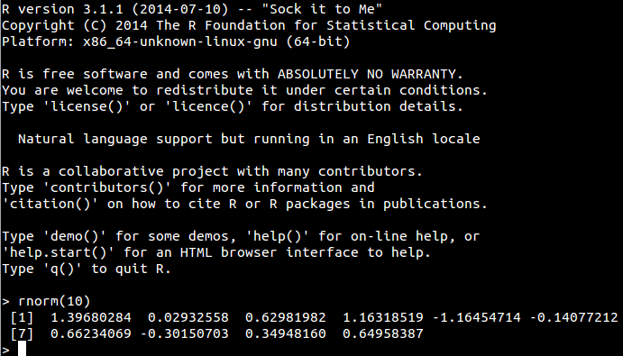

```{r setup, include = FALSE}
#suppress the warnings and other messages from showing in the knitted file.
knitr::opts_chunk$set(
  fig.width  = 8, 
  fig.height = 5, 
  fig.path   = 'images/01/',
  echo       = TRUE, 
  warning    = FALSE, 
  message    = FALSE,
  cache      = TRUE
)
if (!requireNamespace("webex")) {
  stop("You must have the 'webex' package installed to knit HTML from this template.\n   devtools::install_github(\"dalejbarr/webex\")")
} else {
  library("webex")
}
```

## Background

In this workshop, we will be developing scripts in the R programming language using the RStudio Desktop Integrated Development Environment. Before you arrive, please have installed (or at least, please have attempted to install!) R and RStudio on your laptop by [following the instructions provided below](#install).  If you have older versions of these applications already installed, please perform fresh installs of the latest versions (at the time of writing, R 3.5.3 and RStudio Desktop 1.1.463).

Once you have these applications installed and working, you'll also need to install some additional packages that add functionality to the base install.

### What is R?

R is a programming environment for data analysis that was developed almost two decades ago, and has a longer history as a derivative language of the scripting language S-PLUS developed in Bell Labs in the 70s and 80s.  

&ldquo;Base R&rdquo; has an **interactive mode** that consists of a &ldquo;Read Evaluate Print Loop&rdquo; (REPL) command interpreter, in which you type in text commands, which are evaluated, and the results of which are printed to the screen.  This &ldquo;R Console&rdquo; window looks something like this.



You can access all the functionality of R by interactively typing commands into the console, but it is far more convenient to interact with R through an Integrated Development Environment, such as RStudio.

### The RStudio Integrated Development Environment (IDE)
<a name="rstudio_ide"></a>

When you are developing a script, you will generally type into a text editor and send the commands you type to the console, rather than typing commands directly into the console.  The RStudio Desktop IDE is integrated with the R console and offers additional functionality that helps you write code more accurately and efficiently.  Other IDEs are available, including [Jupyter notebooks](https://jupyter.org/) and [emacs org-mode](https://orgmode.org/), but for most users---and especially, for novices---[RStudio](http://www.rstudio.com) is the best option.

## Installation {#install}
<a name="installr"></a>

You will be installing three things:

1. Base R (and RTools if you're a Windows user)
2. The RStudio Desktop IDE
3. Add-on packages for R

Installing R and RStudio is fairly easy. The sections below explain how.

### 1. Installing Base R

Go to <https://cloud.r-project.org/> and choose the
download link for your operating system (Linux, Mac OS X, or Windows)
and install &lsquo;base&rsquo; binaries for distribution. If you are using Linux
or Mac OS, you are done; skip to the next section on RStudio. 

If you are installing on Windows, after you install R, you should
also install [RTools](https://cloud.r-project.org/bin/windows/Rtools/). Click on the
&lsquo;recommended&rsquo; (not the experimental) version near the top of the list (`Rtools35.exe` at the
time of writing).

### 2. Installing RStudio Desktop

Only install RStudio Desktop IDE **after** you have successfully installed base R. Go to <https://www.rstudio.com/products/rstudio/download/#download> and under the heading "Installers for Supported Platforms" and download the version for your operating system.

#### Launch RStudio

After installation, you will have icons for both RStudio and &ldquo;R commander&rdquo; on your system. R Commander is a primitive IDE that comes packaged with R. Don't use this; always use RStudio.  

Make sure you launch the RStudio IDE and not R commander by clicking on the correct icon.  Launching RStudio will also launch the R console, which will appear embedded in a window pane within the application.

<p class="alert alert-warning">
ALWAYS REMEMBER:

</p>

If your installation was successful, once you launch RStudio, you should see a screen that looks like this:


### 3. Installing add-on packages

There is a large number of **add-on packages** that add additional functionality to R.  Below we'll take you step by step through the process.

To install packages, we're going to type commands into the R console window. The console is the part of the RStudio IDE that looks like this:


There is a cursor just next to the caret `>` symbol at the bottom where you type in your commands.

#### Install the `tidyverse`

The first thing we will install is the [tidyverse](http://www.tidyverse.org). The tidyverse is actually a **meta-package**---a collection of packages---which are useful for data processing and visualization.  Depending on the speed of your computer, it might take a few minutes or maybe even 10 minutes or more for the install process to complete. 

To install the tidyverse, type the following code in the console and press return.

```{r tidyverse, eval = FALSE}
install.packages("tidyverse")
```

It will first download all the packages, so you'll see a lot of text fly by that looks like this:

```
trying URL 'https://cloud.r-project.org/src/contrib/packagename_X.XX.tar.gz'
Content type 'application/x-gzip' length 3146818 bytes (3.0 MB)
==================================================
downloaded 3.0 MB
```

That is perfectly normal behavior.  Some packages are compiled from source, and after download, a lot of gibberish will appear on the screen. Again, this is perfectly normal and should not be a cause for panic. Here is an example of what this gibberish looks like:

```
/home/dalebarr/R/x86_64-pc-linux-gnu-library/3.4/TMB/include/atomic_math.hpp:426:1:   required from ‘void atomic::matmul(const CppAD::vector<Type>&, CppAD::vector<Type>&) [with Double = double]’
/home/dalebarr/R/x86_64-pc-linux-gnu-library/3.4/TMB/include/atomic_math.hpp:426:1:   required from ‘bool atomic::atomicmatmul<Type>::forward(size_t, size_t, const CppAD::vector<bool>&, CppAD::vector<bool>&, const CppAD::vector<Type>&, CppAD::vector<Type>&) [with Type = double; size_t = long unsigned int]’
glmmTMB.cpp:863:1:   required from here
```

When each package installs successfully, you'll see text that looks like this:

```
* installing *source* package ‘dplyr’ ...
** package ‘dplyr’ successfully unpacked and MD5 sums checked
** R
** inst
** preparing package for lazy loading
** help
*** installing help indices
** building package indices
** testing if installed package can be loaded
* DONE (dplyr)
```

Hopefully, none of the packages will result in errors and you'll be returned to the caret `>` prompt. But if you get errors happens, we can help you diagnose any problems on the first morning after arrival.

If you want to learn more about what packages are included in the tidyverse and what they do, check out <http://www.tidyverse.org>.

#### Install additional packages

After installing the tidyverse, let's install some more packages that you'll need. Copy the text below into your console.

```{r other-packages, eval = FALSE}
install.packages(c("ez", "lme4", "afex", "pbkrtest", "boot", "car", "MASS", 
                   "sjPlot", "yarrr", "pwr", "broom"))
```

This will probably take a few minutes to complete, and you'll see lots more gibberish appear in the console while the packages install.

#### Install RMarkdown and related packages

We will be learning to create **dynamic reports** in RMarkdown, which is a text-based format for integrating code, text, and graphics.

The easiest way to install the packages you need for this is to just create a new RMarkdown document, and RStudio will prompt you to install the packages that are required.

From the pull down menu, choose `File -> New File -> RMarkdown...` and this will lead you to the prompt to install packages.

Once they're installed, you're ready to go!

### Additional tweaks you might want to try

After installing R and RStudio is itself very easy, you might want to tweak your installation a bit.

#### Changing how RStudio looks

The appearance of RStudio is fully configurable. You can try out different options by going to `Tools --> Global Options` and then choosing the Appearance icon. You can choose a bigger font or change the color theme. Express yourself!

#### Compiling PDF reports

This tweak is a bit harder and completely optional. If you want to be able to compile reports to PDF, then you'll need to install LaTeX typesetting on your system.  Without this additional tweak, you will be able to produce reports in HTML but not PDF. There are various options, but the easiest is probably TinyTeX: <https://yihui.name/tinytex>.
