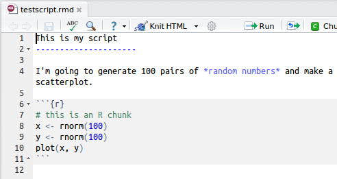

```{r setup, include = FALSE}
#suppress the warnings and other messages from showing in the knitted file.
knitr::opts_chunk$set(
  fig.width  = 8, 
  fig.height = 5, 
  fig.path   = 'images/01/',
  echo       = TRUE, 
  warning    = FALSE, 
  message    = FALSE,
  cache      = TRUE
)
if (!requireNamespace("webex")) {
  stop("You must have the 'webex' package installed to knit HTML from this template.\n   devtools::install_github(\"dalejbarr/webex\")")
} else {
  library("webex")
}
```


## Learning objectives

1. Understand the [R console](#rconsole) and the components of the [RStudio IDE](#rstudio_ide)
2. Appropriately [structure an R script](#structure)
3. Install [add-on packages](#addons)
4. Use R as a [calculator](#rcalc)
5. Understand the [basic data types](#data_types) (integer, double, character, factor)
6. [Create vectors](#vectors) and store values as [variables](#vars)
7. Understand [vectorized operations](#vectorized_ops)
8. Call [functions](#functions) and supply arguments
9. String together operations using [pipes](#pipes)
10. [Load data](#load_data) from a CSV and Excel files
11. Create a simple [data frame](#data_frame) by hand
12. Create and compile an [Rmarkdown document](#rmarkdown)

## Introduction

### What is `R`?

*A programming environment for data processing and statistical analysis*


-   free and open-source
-   community supported
-   continually evolving
-   promotes *reproducible research*

### Interacting with `R`

#### The Base R Console
<a name="rconsole"></a>

R is was developed almost two decades ago, and has a longer history as a derivative language of the scripting language S-PLUS developed in Bell Labs in the 70s and 80s.  &ldquo;Base R&rdquo; consists of a &ldquo;Read Evaluate Print Loop&rdquo; (REPL) command interpreter, in which you type in text commands, which are evaluated, and the results of which are printed to the screen.  This &ldquo;R Console&rdquo; window looks something like this.


#### The RStudio Integrated Development Environment (IDE)
<a name="rstudio_ide"></a>

However, when you are developing a script, you will want to work in a text editor and send commands to the console, rather than typing directly into the console.  Developing an analysis script is R is essentially an exercise in programming, and for developing code it is best to use an Integrated Development Environment or IDE.  An IDE provides additional functionality that wraps around the basic console.  


The IDE that is highly recommended for this class is by RStudio (<http://www.rstudio.com>) and is depicted above.  This IDE provides multiple windows in additional to the console that greatly facilitate developing code.  In addition to the console (appearing as the bottom left window in the above figure), there is a script editor (top left), which provides syntax highlighting, autocompletion, and pop-up tool tips, a window showing functions and objects residing in memory for the session in the &ldquo;Environment&rdquo; tab (top right window in the figure), and a window that shows plots, files in the working directory, available add-on packages, and documentation (bottom right).

You will install both base R and RStudio, but will interact with R through the RStudio IDE.  You will have icons for both RStudio and for a very primitive IDE called &ldquo;R commander&rdquo; which comes packaged with R.  R commander is not as sophisticated or user-friendly as RStudio, so make sure you launch the RStudio IDE and not R commander by clicking on the correct icon.  Launch RStudio will also launch the R console, so that is all you need to click.

<p class="alert alert-warning">ALWAYS REMEMBER: Launch R though the RStudio IDE</p>


#### Configure RStudio to maximize reproducibility and minimize confusion

In this class, you will be learning how to develop *reproducible scripts*.  This means scripts that completely and transparently perform some analysis from start to finish in a way that yields the same result for different people using the same software on different computers.  And transparency is a key value of science, as embodied in the &ldquo;trust but verify&rdquo; motto.  When you do things reproducibly, others can understand and check your work.  This benefits science, but there is a selfish reason, too: the most important person who will benefit from a reproducible script is your future self.  When you return to an analysis after two weeks of vacation, you will thank your earlier self for doing things in a transparent, reproducible way, as you can easily pick up right where you left off.

<p class="alert alert-info">There are two tweaks that you should do to your RStudio installation to maximize reproducibility.  Go to the setting menu, and uncheck the box that says &ldquo;Restore .RData into workspace at startup&rdquo;.  If you keep things around in your workspace, things will get messy, and unexpected things will happen.  You should always start with a clear workspace.  This also means that you never want to save your workspace when you exit, so set this to &ldquo;Never&rdquo;.  The only thing you want to save are your scripts.</p>


Another tweak that we recommend for beginners is to turn off **inline results** and **image previews** in RMarkdown files. RMarkdown files are just plain text, but by default, RStudio makes it look like images and results appear inside the text. Beginners who are mostly familiar with software such as MS Word easily get the wrong idea that these are 'part' of the file. IT can be very confusing for beginners, so let's turn those options off. You can best see the results of a code chunk by running it and looking in the console window and you can view images as pop-ups.


## Live coding demo: Developing reproducible R scripts

The instructor will now go through a live coding exercise that will give you a basic overview of developing an R script using the RStudio IDE.

Feel free to just watch or to follow along by typing into your own script. 

This demonstration will make use of a dataset of Berlin Babynames from 2012-2020 provided by [Berliner Landesamt für Bürger- und Ordnungsangelegenheiten (LABO) / BerlinOnline Stadtportal GmbH & Co. KG](https://github.com/berlinonline/haeufige-vornamen-berlin). You will need to download my version of the data, which has all of the info in one big file: [berlin-babynamen.csv](berlin-babynamen.csv) (CSV format)

An R script is the most basic type of document you can work with. It is simply a plain-text file containing a set of commands to be executed in sequence, from top to bottom.

All scripts should follow this generic structure:
<a name="structure"></a>

-   load in any add-on packages you need to use
-   define any custom functions
-   load in the data you will be working with
-   work with the data
-   save anything you need to save

Here is an example (the live-coding script may differ):

```{r demo-script, eval = FALSE}
# load add-on packages that we need
library("tidyverse")
library("cowsay")

bbnames <- read_csv("berlin-babynamen.csv", col_types = "ficif")

who <- c("Dale", "Juliane", "Pia")

dat <- bbnames %>%
  filter(vorname %in% who) %>%
  mutate(vorname = factor(vorname)) %>%
  group_by(jahr, vorname, .drop = FALSE) %>%
  summarise(tot = sum(anzahl), .groups = "drop")

g <- ggplot(dat, aes(jahr, tot)) +
  geom_line() +
  facet_wrap(~ vorname, scales = "free_y")

ggsave("names.png", g)

# if you lack the cowsay package, then type
# the following in the console:
# install.packages("cowsay")
say("We did it!", "signbunny")
```

Some of the skills and tips demonstrated in the live coding session include:

- [installing](#addons) and loading in add-on packages
- setting the [working directory](#workdir)
- [data import](#load)
- data entry using a "tibble"
- navigating between the script pane and console pane using the shortcut keys Ctrl+1 and Ctrl+2
- running a line of code using Ctrl+Enter
- [getting help](#help)
- embedding code into chunks in an [RMarkdown document](#rmarkdown)
- "knitting" (compiling) a dynamic report from RMarkdown

We will go into some of these skills in more depth later in this document.

## Self-guided introduction with exercises

### Typing in commands

We are first going to learn about how to interact with the console.  In generally, you will be developing R scripts or R markdown files, rather than working directly in the console window.  However, you can consider the console a kind of &rsquo;sandbox&rsquo; where you can try out lines of code and adapt them until you get them to do what you want.  Then you can copy them back into the script editor.

Mostly, however, you will be typing into the script editor window (either into an R script or an RMarkdown file) and then sending the commands to the console by placing the cursor on the line and holding down the Ctrl key while you press Enter.  The Ctrl+Enter key sequence sends the command in the script to the console.

#### Warming up: Use R as a calculator
<a name="rcalc"></a>

One simple way to learn about the R console is to use it as a calculator.  Enter the lines of code below and see if your results match.  Be prepared to make lots of typos (at first) :/

```{r calc1}
## REPL: Read/Evaluate/Print Loop
## R prints results back at you
1 + 1
```

The R console remembers a history of the commands you typed in the past.  Use the up and down arrow keys on your keyboard to scroll backwards and forwards through your history.  It's a lot faster than re-typing.

```{r calc2}
1 + 1 + 3
```

You can break up math expressions over multiple lines; R waits for a complete expression before processing it.

```{r calc3}
## here comes a long expression
## let's break it over multiple lines
1 + 2 + 3 + 4 + 5 + 6 +
    7 + 8 + 9 +
    10
```

```{r char-demo}
"Good afternoon"
```

You can break up text over multiple lines; R waits for a close quote before processing it.

```{r multiline-char-demo}
"There is nothing in the world 
that makes people so unhappy as fear.  
The misfortune that befalls us is 
seldom, or never, as bad as that 
which we fear.

- Friedrich Schiller"
```

You can add comments to an R script by with the &rsquo;#&rsquo; symbol.  The R interpreter will ignore characters from the # symbol to the end of the line.

```{r comment-demo}
## comments: any text from '#' on is ignored until end of line
22 / 7  # approximation to pi
```

- **Exercise:** Calculate 8,657 divided by 6.5.

`r hide()`
```{r chal1}
    8657/6.5
    ```
`r unhide()`

#### Storing results in a variable
<a name="vars"></a>

Often you want to store the result of some computation for later use.  You can store it in a *variable*.  There are some important things to consider when naming your variables.

-   capitalization matters (`myVar` is different from `myvar`)
-   don't use spaces or special characters `(^&"'*+?)` etc.; use the &rsquo;\_&rsquo;
    where you would use a space (e.g., `my_var` is a legal variable
    name)
-   must begin with a letter (`m2` is a valid name, but `2m` is not)

Use the assignment operator `<-` to assign the value on the right to the variable named on the left.

```{r assignment}
## use the assignment operator '<-'
## R stores the number in the variable
x <- 5
```

Now that we have set `x` to a value, we can do something with it:

```{r var-demo}
x * 2

## R evaluates the expression and stores the result in the variable
boring_calculation <- 2 + 2
```

Note that it doesn't print the result back at you when it's stored.  To view the result, just type the variable name on a blank line.

```{r var-demo2}
boring_calculation
```


#### Whitespace

```{r whitespace}
# R waits until next line for evaluation
(3 + 2) *
     5
```

```{r cowsay-intro}
# often useful to spread function arguments over multiple lines
library(cowsay)
say("This function call is far too wide to fit all on one line",
    "stretchycat")
```


<p class="alert alert-warning">When you see `>` at the beginning of a line, that means R is waiting for you to start a new command.  However, if you see a `+` instead of `>` at the start of the line, that means R is waiting for you to finish a command you started on a previous line.  If you want to cancel whatever command you started, just press the Esc key in the console window and you&rsquo;ll get back to the `>` command prompt.</p>

#### The workspace

Anytime you assign something to a new variable, R creates a new object in your workspace.  Objects in your workspace exist until you end your session; then they disappear forever (unless you save them).

```{r workspace}
ls()  # print the objects in the workspace

rm("x")   # remove the object named x from the workspace

rm(list = ls()) # clear out the workspace
```

### Some basic data types
<a name="data_types"></a>

There are four main basic data types in R (there are more, but these are the critical ones you need to know about).

|type         | examples                         |
|-------------|----------------------------------|
| `character` | "hello", "ABCDE1", "12 45", "123.45"|
| `integer`   | 10L, 50L, 1L, -20L                  |
| `double`    | 10, 3.1415, -99.7, 0.001, -3.5e6    |
| `logical`   | `TRUE`, `FALSE`                   |

There is also a specific data type called a `factor` which will probably give you a headache sooner or later, but we can get by for now without them.

Character strings can include basically anything, including quotes, but if you want a quote to be included you have to 'escape' it using a backslash:

```{r quote}
my_string <- "The instructor said, \"R is cool,\" and the class agreed."
my_string
```

Note that if you just type a plain number such as `10` it is stored as a double, even if it doesn't have a decimal point. If you want it to be an exact integer, use the `L` suffix (`10L`).

If you ever want to know the data type of something, use the class function.  There is also the `mode` function which is specifically for vectors.

```{r class}
class(10) # numeric
class(10L) # integer
class("10") # string
class(10L == 11L) # logical
mode(TRUE)
```

### Vectors
<a name="vectors"></a>

One of the most fundamental data types in R is the vector.  A vector in R is like a vector in math: a set of ordered elements.  All of the elements in a vector must be of the same *data type* (numeric, character, factor).  You can create a vector by enclosing the elements in `c(...)`, as shown below.

```{r vectors}
## put information into a vector using c(...)
c(1, 2, 3)

c("this", "is", "cool")

## what happens when you mix types?
c(2, "good", 2, "b", "true")
```

<p class="alert alert-warning">You can't mix data types in a vector; all elements of the vector must be the same data type. If you mix them, R will coerce them so that they are all the same.</p>


- **Exercise:** Create a new object `vect1` that contains the following six values: 3, 15, 7.6, 9, 15, 42

`r hide()`
```{r chal2}
vect1 <- c(3, 15, 7.6, 9, 15, 42)
```
`r unhide()`

OK, that's easy enough, but here's a question. When you type a single number in the console, it spits it back out to you, like this:

```{r three}
3
```

Why is there a `[1]` there in the output? i.e., why is the output `[1] 3` and not just `3`?

We'll eventually get to the answer, but let's see if you can discover it yourself through experiment. There is an operator `:` that, when placed between two integers `x` and `y` like so: `x:y` will yield the sequence of integers from x to y inclusive. Let's make a big long vector of numbers and print it out.

```{r big_long_vector}
vec <- 200:400
vec
```

Note the number in square brackets on the left hand side of the output. What do you think this is?

The variable `vec` is an ordered container of 200 elements, in this case, the integers from 200 to 400. The bracked number on the left hand side tells you the **numeric index** (i.e., element number) corresponding to the first value in that row. So the first value is 200, the 19th value is 218, the 37th value is 236, etc.

You can pick the nth element from a vector using the bracket syntax. For instance, let's pull out the 2nd element of `vec`.

```{r bracket-syntax}
vec[2]
```

Recall that the `c()` operator creates vectors. If we wanted to pick out more than one specific value of some vector by position, we can make a vector of numbers like so:

```{r vec_index}
c(1L, 19L, 37L, 55L)
```

And then pull them out using the `[]` operator, which is the *extraction* operator, on the variable `vec`.

```{r vec_index1}
vec[c(1L, 19L, 37L, 55L)]

## note also:
index <- c(1L, 19L, 37L, 55L)
vec[index]

vec[c(1L, 1L, 19L, 19L, 19L, 19L)]
```

OK let's return to our original question: why did we get `[1] 3` when we just typed `3L`?  The answer should now be clear: when we entered a single number, R created a vector with a single element.

You can also create 'named' vectors, where each elements has a name. For example:

```{r vec_named}
vec2 <- c(first = 77.9, second = -13.2, third = 100.1)
vec2
```

We can then access elements by name using a character vector within the square brackets. We can put them in any order we want, and we can repeat elements:

```{r vec_named2}
vec2[c("third", "second", "second")]
```

We can get the vector of names using the `names()` function, and we can set or change them using something like `names(vec2) <- c("n1", "n2", "n3")`.

Another way to access elements is by using a logical vector within the square brackets. This will pull out the elements of the vector for which the corresponding element of the logical vector is `TRUE`. The logical vector must have the same length as the original. You can find out how long a vector is using the `length()` function.

```{r vec_len}
length(vec2)
vec2[c(TRUE, FALSE, TRUE)]
```

Here are some useful tricks to save typing when creating vectors. Recall that in the command `x:y` the `:` operator would give you the sequence of integers from `x:y`. 

What if you want to repeat a vector many times? You could either type it out (painful) or use the `rep()` function, which can repeat vectors in different ways.

```{r rep1}
# ten zeroes
rep(0, 10)

# alternating 1 and 3, 7 times
rep(c(1L, 3L), 7)

rep(c(TRUE, FALSE), 2)
```

What if you want to create a sequence but with something other than integer steps? You can use the `seq()` function. You can learn about this in the exercises below.

```{r rep}
# Repeat a vector
# See the ?rep function
rep(c(TRUE, FALSE), 3)

# Get every other (odd) element of vec
vec[rep(c(TRUE, FALSE), 100)]

# We can also store the logical vector in a variable and use that
evens <- rep(c(FALSE, TRUE), 100)
```


#### Exercises
<a name="ex_vector"></a>

1. The built-in vector `letters` contains the letters of the English alphabet.  Use an indexing vector of integers to extract the letters that spell 'cat'.
   <div class="solution"><button>Solution</button>
    ```{r ex_vec_1, eval = FALSE}
    letters[c(3, 1, 20)]
    ```
    </div>
    
2. The function `colors()` returns all of the color names that R is aware of. What is the length of the vector returned by this function? (Use code to find the answer.)
   <div class="solution"><button>Solution</button>
    ```{r ex_vec_2, eval = FALSE}
    length(colors())
    ```
    </div>


### Vectorized Operations
<a name="vectorized_ops"></a>

R performs calculations on vectors in a special way.  Let's look at an example using \(z\)-scores.  \(z\)-scores is *deviation score* (a score minus a mean) divided by a standard deviation.  You will learn more about these concepts later in the course.  Let's say we have a set of four IQ scores.

```{r vectorised-calc1}    
## example IQ scores: mu = 100, sigma = 15
iq <- c(86, 101, 127, 99)
```

If we want to subtract the mean from these four scores, we just use the following code:

```{r vectorised-calc2}    
iq - 100
```

This subtracts 100 from each element of the vector.  R automatically assumes that this is what you wanted to do; it is called a *vectorized operation* and it makes it possible to express operations more efficiently.

To calculate \(z\)-scores we use the formula:

\(z = \frac{X - \mu}{\sigma}\)

where X are the scores, \(\mu\) is the mean, and \(\sigma\) is the standard deviation.  We can expression this formula in R as follows:

```{r z-scores}    
## z-scores
(iq - 100) / 15
```

You can see that it computed all four \(z\)-scores with a single line of code.  Very efficient!

One thing that is very useful are vectorized logical tests. For instance, let's say you wanted to find out which of a set of p-values are lower than .05.  You could do it easily like so:

```{r pvals}
my_pvals <- c(.1, .001, .33, .049, .051, .02, .773)
my_pvals < .05
```

You could then pull out only the significant p-values like so:

```{r sig-ps}
my_pvals[my_pvals < .05]
```

In plain English, the above command says, "give me those elements of `my_pvals` for which `my_pvals < .05` is true."" Note that `my_pvals < .05` is first evaluated to create a logical vector, and this logical vector is then used as an index to `my_pvals`.

#### Exercises

1. Create a vector of integers from 0 to 20 and store it in the variable `my_ints`. Then divide all of the values by 5.

`r hide()`
```{r my-ints}
my_ints <- 0:20
my_ints / 5
```
`r unhide()`

2. The modulo operator in R is `%%`. A command such as `x %% y` where `x` and `y` are integers will give the remainder of `x` given the divisor `y`.  (For instance, `5 %% 3` will give 2 because 2 is the remainder you get when you divide 5 by 3.) Calculate the modulo of the values in `my_ints` for a divisor of 5.

`r hide()`
```{r modulo}
my_ints %% 5
```
`r unhide()`

3. The function call `runif(1000, 0, 1)` will draw 1000 numbers from a uniform distribution from 0 to 1, which simulates the p-values that you would get from 1000 experiments where the null hypothesis is true. Store the result of this call in `pvals`. Create a logical vector called `is_sig` that is `TRUE` if the corresponding element of `pvals` is less than .05, `FALSE` otherwise (hint: vectorized operations from the last lession), then use this logical vector to pull out those p-values. Finally, calculate the proportion of those p-values that were significant.

`r hide()`
```{r ex_vec_3, eval = FALSE}
pvals <- runif(1000, 0, 1)

is_sig <- pvals < .05

sort(pvals[is_sig])

length(pvals[is_sig]) / length(pvals)
```
`r unhide()`


### Add-on packages
<a name="addons"></a>

One of the great things about R is that it is *user extensible*: anyone can create a new add-on software package that extends its functionality.  There are currently thousands of add-on packages that R users have created to solve many different kinds of problems, or just simply to have fun.  There are packages for data visualisation, machine learning, neuroimaging, eyetracking, web scraping, and playing games such as Sudoku.

Add-on packages are not distributed with base R, but have to be downloaded and installed from an archive, in the same way that you would, for instance, download and install a fitness app on your smartphone.

The main repository where packages reside is called CRAN, the Comprehensive R Archive Network.  A package has to pass strict tests devised by the R core team to be allowed to be part of the CRAN archive.  You can install from the CRAN archive through R using the `install.packages()` function.

There is an important distinction between *installing* a package and
*loading* a package.

-   *Installing* a package is done using `install.packages()`.  This is
    like installing an app on your smartphone: you only have to do it
    once and the app will remain installed until you remove it.  For
    instance, if you want to use Facebook on your phone you install it
    once from the App Store or Play Store, and you don't have to
    re-install it each time you want to use it.  Once you launch the
    app, it will run in the background until you close it or restart
    your phone.  Likewise, when you install a package, the package will
    be available (but not *loaded*) every time you open up R.

-   *Loading* a package: This is done using `library(packagename)`.
    This is like **launching** an app on your phone: the functionality is
    only there where the app is launched and remains there until you
    close the app or restart.  Likewise, when you run
    `library(packagename)` within a session, the functionality of the
    package referred to by `packagename` will be made available for your
    R session.  The next time you start R, you will need to run the
    `library()` function again if you want to access its functionality.

You may only be able to permanently install packages if you are using R on your own system; you may not be able to do this on public workstations because you will lack the appropriate privileges.

Try installing the library fortunes on your system:

```{r install-fortunes, eval = FALSE}
install.packages("fortunes")
```

If you don't get an error message, the installation was successful. 

You can then access the functionality of `fortune` for your current R session as follows:

```{r library-fortunes}
library(fortunes)
```

Once you have typed this, you can run the function `fortune()`, which spouts random wisdom from one of the R help lists:

```{r fortune-demo}
fortune()
```

Note that we will use the convention `package::function()` and `package::object` to indicate in which add-on package a function or object resides.  For instance, if you see `readr::read_csv()`, that refers to the function `read_csv()` in the `readr` add-on package.  If you see a function introduced without a package name, that means it is part of the base R system and not an add-on package (depending on the context).  Sometimes I will make this explicit by using `base` in the place of the package name; for instance, I might refer to `rnorm()` in base as `base::rnorm()`.

### Getting help {#help}

```{r help, eval = FALSE}
# these methods are all equivalent ways of getting help
help("say") # if package 'cowsay' is loaded
?say
help("say", package="cowsay") # if cowsay not loaded

??say # search for help files with "say"

# start up help in a browser
help.start()
```


### Calling functions
<a name="functions"></a>

R has a lot of build in functions that are useful, like `round()` for rounding numbers, and `sort()` for sorting them.  Here are some examples of how to use these functions.

```{r functions-demo}
iq_z <- (iq - 100) / 15

sort(iq_z)

round(iq_z, 2)
```

If we wanted to sort the scores before rounding them, we can embed the `sort(iq_z)` function into the first argument of `round()`.

```{r functions-demo2}
round(sort(iq_z), 2)
```

#### Function syntax

Functions have the following generic syntax:

`functionname(arg1, arg2, arg3, ...)`

Each function has *named arguments* which may or may not have default
values.  Arguments without default values are *mandatory*; arguments
with these values are *optional*.  If an optional argument is not
specified, it will take on the default value.  You can *override* default values by supplying your own.

Arguments can be specified by:

-   position (unnamed)
-   name

Most functions return a value, but may also produce &rsquo;side effects&rsquo;
like printing to the console.

To illustrate, the function `rnorm()` generates random numbers from the standard normal distribution.  The help page for `rnorm()` (accessed by typing `?rnorm` in the console) shows that it has the syntax 

`rnorm(n, mean = 0, sd = 1)`

where `n` is the number of randomly generated numbers you want, `mean` is the mean of the distribution, and `sd` is the standard deviation.  The default mean is 0, and the default standard deviation is 1.  There is no default for `n` which means you&rsquo;ll get an error if you don't specify it:

```{r rnorm, eval = FALSE}
rnorm()
```

`Error in rnorm() : argument "n" is missing, with no default`

If you want 10 random numbers from a distribution with mean of 0 and standard deviation, you can just use the defaults.

```{r rnorm-10}
rnorm(10)
```

If you want 10 numbers from a distribution with a mean of 100:

```{r rnorm-10-100}
rnorm(10, 100)
```

This would be an equivalent but less efficient way of calling the function:

```{r rnorm-n-10-m-100}
rnorm(n = 10, mean = 100)
```

We don't need to name the arguments because R will recognize that we intended to fill in the first and second arguments by their position in the function call.  However, if we want to change the default for an argument coming later in the list, then we need to name it.  For instance, if we wanted to keep the default `mean = 0` but change the standard deviation to 100 we would do it this way:

```{r rnorm-10-sd-100}
rnorm(10, sd = 100)
```

#### Exercises {#cowsay}

For the following exercises, we will be working with the `cowsay` add-on package (`help(package = "cowsay")`)

Check to see if there are any *vignettes* available for this package.

```{r cowsay-vignette, eval = FALSE}
vignette(package = "cowsay")
```

Load in and read the vignette to get an idea of how the package works.

```{r cowsay-tutorial, eval = FALSE}
vignette("cowsay_tutorial", package = "cowsay")
```

Your first task is to develop a reproducible script that accomplishes the tasks below. Compile the RMarkdown (rmd) document into HTML. Make sure the report includes the code in addition to the output.

Important! Try to perform each task making the shortest function call you can by taking advantage of the function defaults and include the results in an R script.

```{r library-cowsay, include = FALSE}
library("cowsay")
```

1. Make a cat say, “FEED ME”

    <div class="solution"><button>Solution</button>
    ```{r ex1}
    say("FEED ME")
    ```
    </div>

2. Make a shark say “Hello world!”

    <div class="solution"><button>Solution</button>
    ```{r ex2}
    say("Hello world!", "shark")
    ```
    </div>

3. Make anything produce a famous quote

    <div class="solution"><button>Solution</button>
    ```{r ex3}
    say("If you want to know what God thinks of money, just look at the people he gave it to. ~Dorothy Parker", 
        "grumpycat")
    ```
    </div>

4. Make a clippy warn the user about the impending apocalypse

    <div class="solution"><button>Solution</button>
    ```{r ex4}
    say("It looks like you are trying to annihilate the planet with a particle beam. Are you sure you want to do this?", "clippy")
    ```
    </div>

5. Make a cat produce a random quote from an R coder. You should get a different quote every time you run the code (hint: read the documentation for `cowsay::say()`).

    <div class="solution"><button>Solution</button>
    ```{r ex5}
    say("fortune")
    ```
    </div>

6. Define a variable named `creature` and assign to it the value of one of the types of creatures accepted by the say() function. Then use the variable to output the current time.

    <div class="solution"><button>Solution</button>
    ```{r spider}
    creature <- "spider"

    say(base::date(), creature)
    ```
    </div>

7. Change the value of the variable `creature` to some other thing, and make it display the time.

    <div class="solution"><button>Solution</button>
    ```{r ex7}
    creature <- "buffalo"

    say(base::date(), creature)
    ```
    </div>

8. Restart R and re-run the script to check whether it is reproducible.


### Stringing together commands with pipes {#pipes}

Pipes (`%>%`) are very useful for stringing together a sequence of commands in R. They might be a bit confusing at first but they are worth learning because they will make your code more readable and efficient.
Because pipes are a recent innovation, they are not part of base R. That means you need to load an add-on package to use them. Although the "home" package of the pipe operator is a package called magrittr, more commonly you will gain access to them by loading the tidyverse package (`library("tidyverse")`). If you get either of the following errors in your script:

`Error: unexpected SPECIAL in "%>%"`  
or  
`Error: could not find function "%>%"`

you tried to use `%>%` before doing `library("tidyverse")`.


It is easiest to understand how to use pipes through an example. Let's say that we want to sample 5 random integers between 1 and 10 (with replacement), figure out which unique numbers were sampled, and then sort them in descending order. We will need to call three functions in a sequence: `sample()` to generate the integers, `unique()` to figure out which unique integers were sampled (because the same integer may have been sampled multiple times), and then `sort()` with `decreasing = TRUE` to put them in descending order. So we might write code like this:

```{r pipe-demo-1}
x <- sample(1:10, 5, replace = TRUE)
y <- unique(x)
sort(y, TRUE) # set second argument to 'TRUE' so that sort order is descending
```


While there is nothing wrong with this code, it required us to define variables x and y which we won't ever need again, and which clutter up our environment. To avoid this you could rewrite this code using nested function calls like so:

```{r pipe-demo-2}
sort(unique(sample(1:10, 5, replace = TRUE)), TRUE)
```

(If the above call looks confusing, it should!) The call to `sample()` is embedded within a call to `unique()` which in turn is embedded within a call to `sort()`. The functions are executed from most embedded (the "bottom") to least embedded (the "top"), starting with the function `sample()`, whose result is then passed in as the first argument to `unique(`), whose result in turn is passed in as the first argument to `sort()`; notice the second argument of sort (`TRUE`) is all the way at the end of the statement, making it hard to figure out which of the three functions it belongs to. We read from left to right; however, understanding this code requires us to work our way from right to left, and therefore unnatural. Moreover it is simply an ugly line of code.

This is where pipes come in. You can re-write the original code using pipes like so:
```{r pipe-demo-3}
sample(1:10, 5, replace = TRUE) %>% 
  unique() %>% 
  sort(TRUE)
```

R will calculate the result of `sample(1:10, 5, replace = TRUE)` and then pass this result as the first argument of `unique()`; then, the result of `unique()` will in turn be passed along as the first argument of `sort()` with the second argument set to `TRUE`. The thing to note here is that for any function call on the right hand side of a pipe, you should omit the first argument and start with the second, because the pipe automatically places the result of the call on the left in that spot.

#### Exercises

1. Re-write the following sequence of commands into a single 'pipeline'.

```{r ex_pipe1}
# do not edit this chunk
x <- 1:20 # integers from 1:20
y <- rep(x, 2) # then repeat them twice
z <- sum(y) # and then take the sum
```

`r hide()`
```{r ex_pipe1_ans}
x <- 1:20 %>% rep(2) %>% sum()
```
`r unhide()`

2. Deconstruct the pipeline below back into separate commands.

```{r ex_pipe2}
# do not edit this chunk
lager <- LETTERS[c(18, 5, 7, 1, 12)] %>%
  rev() %>%
  paste(collapse = "")
```

`r hide()`
```{r ex_pipe2_ans}
regal <- LETTERS[c(18, 5, 7, 1, 12)]
reversed <- rev(regal)
lager <- paste(reversed, collapse = "") # make it into a string
```
`r unhide()`

### Lists

Recall that vectors can contain data of only one type. What if you want to store a collection of data of different data types? For that purpose you would use a `list`. Define a list using the `list()` function.

```{r list-define}   
## information about today
today <- list(date = "2018-12-06",
     n_emails_in_inbox = 500L,
     people_who_stopped_by = c("Niamh", "Lynda", "Alex"),
     weather = "rainy",
     average_temp = 6.5
     )
```

You can access elements of a list either by position:

```{r list_pos}
## note the use of the double square bracket!
today[[2]]
```

or by name, like this:

```{r list_name}
today[["people_who_stopped_by"]]
```

or like this:

```{r list_name2}
today$weather
```

<p class="alert alert-info">Fun fact: tabular data, stored in `data.frame` or `tibble` objects, which you will learn about in the next section, are a special type of list. That means you can access the columns of one of these object using `tablename$column` syntax, which is sometimes useful.</p>

### Tabular data
<a name="tables"></a>

Most of what you will be working with in this course is *tabular data*, data arranged in the form of a table.

Tabular data structures, like lists, allow for a collection of data of different types (characters, integers, logical, etc.) but subject to the constraint that each "column" of the table (element of the list) must have the same number of elements.  The base R version of a table is called a `data.frame` while the 'tidyverse' version is called a `tibble`.  Tibbles are far easier to work with, so we'll be using those. To learn more about differences between these two data structures, see `vignette("tibble")`.

Tabular data becomes especially important for when we talk about **tidy data** later on, which consists of a set of simple principles for structuring data.

If we are creating a tibble from scratch, we can use the `tibble()` function, and type the data right in.  Note that if we want a value to repeat multiple times, we only have to specify a one-element vector; R will expand out the vector to fill out the table.  All columns in the tibble must have the same lengths or be of length 1.

If we want to use the `tibble()` function, we either need to load the tibble package or the tidyverse package (which will itself load tibble in addition to other packages).  Let's do the latter.

```{r tverse, message = FALSE}
library("tidyverse")
```

We can get information about the table dimensions using the functions `ncol()` (number of columns), `nrow()` (number of rows), or `dim()` (a vector with the number of rows and number of columns).

```{r dataframe-define, eval = FALSE}    
months <- tibble(ID = 1:12,
                 name = c("Jan", "Feb", "Mar", "Apr",
                          "May", "Jun", "Jul", "Aug",
                          "Sep", "Oct", "Nov", "Dec"))

# print it
months

# how many rows?
nrow(months)

# how many columns?
ncol(months)
```

#### Viewing your tibble

Always, always, always, look at your data once you've created a table or loaded it in from a file. Also look at it after each step that transforms your tibble. When you view your table, it is best to do this in the console unless you specifically want this to be part of a script or report. 

There are three ways to look at your tibble: `View()` [*NB: capital 'V'], `print()`, and `glimpse()`.  

The `print()` method can be run explicitly, but is more commonly called by just typing the variable name on the blank line. Usually we only call `print()` if we want fine control of how the information is displayed. 

Note that the default is not to print the entire table, but just the first 10 rows. Let's look at the `starwars` table that is built into the tidyverse.

```{r print}
library("tidyverse")
starwars
```

You can see that this is a `r library("tidyverse"); nrow(starwars)` rows by `r ncol(starwars)` column table, and we can only see the first 10 rows and first 8 columns.

If I want to see all 87 rows for some reason, I would use an explicit call to `print()`, and set the argument `n` to the number of rows I want to see. If I want all of them, just use `+Inf`, the symbol for 'infinite' rows.

```{r sw_all, eval = FALSE}
print(starwars, n = +Inf) # try this in the console
```

But we still can't see all the columns. If this is important to us, we can use `glimpse()`, which gives a sideways version of the tibble.

```{r sw_glimpse}
glimpse(starwars)
```

The other way to look at the table is a more graphical spreadsheet-like version given by `View()` (capital 'V').  It can be useful in the console, but don't ever put this one in a script because it will create an annoying pop-up window when the user goes to run it.

Note that `data.frame` objects are printed out in different ways from `tibble` objects. If you print a `data.frame` object with thousands or millions of rows, you won't just get a preview... you will spam your console with row upon row of data.  If you want to make a data.frame into a tibble so that it prints out nicely, just use the `as_tibble()` function.

```{r as_tibble, eval = FALSE}
mtcars # prints out way too many rows; TMI

as_tibble(mtcars) # much cleaner
mtcars2 <- as_tibble(mtcars) # store it
```

#### Accessing rows and columns

There are various base R ways of accessing specific columns or rows from a table that are useful to know about, but you'll be learning easier (and more readable) ways when we get to the lecture on [data wrangling](04_wrangling.Rmd).  Examples of these base R accessing functions are provided here for reference.

```{r dataframe-access, eval = FALSE}   
months[1, ] # first row

months[, 2] # second column (position)

months[1:3, ] # first 3 months

months[, c("Month")] # access column by name

months$month  # by column name
```

You'll learn about the tidyverse way to perform such data frame operations in the afternoon lessons.

#### Exercises
<a name="ex_tibble"></a>

1. Create a tibble with the name, age, and sex of 3-5 people whose names, ages, and sex you know.

`r hide()`
```{r ex1-tab, eval = FALSE}

# or you can do this with the tibble function
family <- tibble(name = c("Lisa", "Ben", "Robbie"),
                 age = c(40, 41, 10),
                 sex = c("female", "male", "male") )

# also note:
# you can type this in row by row, rather than column by column,
# using the 'tribble' function. See ?tribble and 
family <- tribble(~name,  ~age, ~sex,
                  "Lisa",   40,  "female",
                  "Ben",    41,  "male",
                  "Robbie", 10,  "male")

```
`r unhide()`

2. Convert the built-in base R `iris` dataset to a tibble, and store it in the variable `iris2`.

`r hide()`
```{r ex_2_as_tib, eval = FALSE}
iris2 <- as_tibble(iris)
```
`r unhide()`

3. Create a tibble that has the structure of the table below, using the minimum typing possible. (Hint: `rep()`).  Store it in the variable `my_tbl`.

```{r ex_tib3, echo = FALSE}
my_tbl <- tibble(ID = 1:8,
                 A = rep(c("A1", "A2"), each = 4),
                 B = rep(c("B1", "B2"), 4),
                 C = "C1")
my_tbl
```

`r hide()`
```{r ex_3_tib, eval = FALSE}
my_tbl <- tibble(ID = 1:8,
                 A = rep(c("A1", "A2"), each = 4),
                 B = rep(c("B1", "B2"), 4),
                 C = "C1")    
```
`r unhide()`

### Working with files

#### Working Directory {#workdir}

When developing an analysis, you usually want to have all of your scripts and data files in one subtree of your computer's directory structure.  Usually there is a single *working directory* where your data and scripts are stored.  

-   All references to data files in your scripts will be relative to the
    top level of this directory tree; always use *relative*
    paths, and never use *absolute* paths.

-   Never set or change your working directory in a script; always store
    your main script file in the top-level directory and manually set
    your working directory to that location.

For instance, if on a Windows machine your data and scripts live in the directory `C:\Carla's_files\thesis22\my_thesis\new_analysis`, you will set your working directory to `new_analysis` in one of two ways: (1) by going to the `Session` pull down menu in RStudio and choosing `Set Working Directory`, or (2) by typing `setwd("C:\Carla's_files\thesis22\my_thesis\new_analysis")` in the console window.  

<p class="alert alert-warning">Never put the `setwd()` command in your script, because others will not have the same directory tree as you (and when your laptop dies and you get a new one, neither will you).</p>

If your script needs a file in a subdirectory of `new_analysis`, say, `analysis2/dat.rds`, load it in using a relative path:

```{r readRDS, eval = FALSE}
dat <- readRDS("analysis2/dat.rds")  # right way
```

Do not load it in using an absolute path:

```{r abs-path, eval = FALSE}
dat <- readRDS("C:/Carla's_files/thesis22/my_thesis/new_analysis/analysis2/dat.rds")   # wrong
```

<p class="alert alert-info">Also note the convention of using forward slashes, unlike the Windows specific convention of using backward slashes.  This is to make references to files platform independent.</p>

#### Loading Data {#load}
<a name="load_data"></a>

There are many different types of files that you might work with when doing data analysis.  These different file types are usually distinguished by the three letter *extension* following a period at the end of the file name.  Here are some examples of different types of files and the functions you would use to read them in or write them out.

| Extension   | File Type              | Reading                 | Writing |
|-------------|------------------------|-------------------------|---------|
| .csv        | Comma-separated values | `readr::read_csv()`    | `readr::write_csv()` |
| .xls, .xlsx | Excel workbook         | `readxl::read_excel()` | N/A |
| .rds        | R binary file          | `readRDS()`             | `saveRDS()` |
| .RData      | R binary file          | `load()`                | `save()` |

Note: following the conventions introduced above in the section about add-on packages, `readr::read_csv()` refers to the `read_csv()` function in the `readr` package, and `readxl::read_excel()` refers to the function `read_excel()` in the package `readxl`.

Probably the most common file type you will encounter is `.csv` (comma-separated values).  As the name suggests, a CSV file distinguishes which values go with which variable by separating them with commas, and text values are sometimes enclosed in double quotes.  The first line of a file usually provides the names of the variables.  For example, here are the first few lines of a CSV containing Scottish baby names (see [the page at National Records Scotland](http://www.nrscotland.gov.uk/statistics-and-data/statistics/statistics-by-theme/vital-events/names/babies-first-names/babies-first-names-summary-records-comma-separated-value-csv-format)):

    yr,sex,FirstForename,number,rank,position
    1974,B,David,1794,1,1
    1974,B,John,1528,2,2
    1974,B,Paul,1260,3,3
    1974,B,Mark,1234,4,4
    1974,B,James,1202,5,5
    1974,B,Andrew,1067,6,6
    1974,B,Scott,1060,7,7
    1974,B,Steven,1020,8,8
    1974,B,Robert,885,9,9
    1974,B,Stephen,866,10,10

There are six variables in this dataset, and their names are given in the first line of the file: `yr`, `sex`, `FirstForename`, `number`, `rank`, and `position`.  You can see that the values for each of these variables are given in order, separated by commas, on each subsequent line of the file.

When you read in CSV files, it is best practice to use the `readr::read_csv()` function. The `readr` package is automatically loaaded as part of the `tidyverse` package, which we will be using in almost every script. Note that you would normally want to store the result of the `read_csv()` function to a variable, as so:

```{r load-tidyverse}
library(tidyverse)
```

```{r read_csv, eval = FALSE}
dat <- read_csv("my_data_file.csv")
```

Once loaded, you can view your data using the data viewer.  In the upper right hand window of RStudio, under the Environment tab, you will see the object `dat` listed.


If you click on the View icon (), it will bring up a table view of the data you loaded in the top left pane of RStudio.


This allows you to check that the data have been loaded in properly.  You can close the tab when you&rsquo;re done looking at it&#x2014;it won't remove the object.

#### Writing Data

If you have data that you want to save your data to a CSV file, use `readr::write_csv()`, as follows.

```{r write_csv, eval = FALSE}
write_csv(dat, "my_data_file2.csv")
```

This will save the data in CSV format to your working directory.


## Reproducible reports with RStudio and RMarkdown
<a name="rmarkdown"></a>

We will be working toward producing reproducible reports following the principles of &ldquo;literate programming&rdquo;.  The basic idea is to have the text of the report together in a single document along with the R code needed to perform all analyses and generate the tables.  The report is then &rsquo;compiled&rsquo; from the original format into some other, more portable format, such as HTML or PDF.  This is different from traditional cutting and pasting approaches where, for instance, you create a graph in Microsoft Excel or a statistics program like SPSS and then paste it into Microsoft Word.

We will be using RMarkdown to create reproducible reports, which enables interleaving text with R code blocks.

You can read more about Donald Knuth's idea about literate programming at this [Wikipedia page](https://en.wikipedia.org/wiki/Literate_programming), and about the RMarkdown format [here](http://rmarkdown.rstudio.com/lesson-1.html).



A reproducible script will contain sections of code in code blocks.  A code block is delimited using three backtick symbols in a row, like so:

    This is just some text before the code block
    
    ```{r blockname}
    # now we are inside the R code block
    rnorm(10)  # generate some random numbers
    ```
    
    now we're back outside the code block

If you open up a new RMarkdown file from a template, you will see an example document with several code blocks in it.

To create an HTML or PDF report from an rmarkdown (rmd) document, you compile it.  Compiling a document is called &rsquo;knitting&rsquo; in RStudio.  There is a button that looks like a ball of yarn with needles through it that you click on to compile your file into a report.  Try it with the template file and see what happens!

- **Exercise**: Create an RMarkdown file including each answer from the [exercises on function calls in cowsay](#cowsay) (questions 1--7 only), and compile it to HTML.

## Resources

You may find these additional resources useful in supporting your learning about R/RStudio.

- [RStudio projects](https://support.rstudio.com/hc/en-us/articles/200526207-Using-Projects)  
- [RStudio IDE Cheatsheet](https://github.com/rstudio/cheatsheets/raw/master/rstudio-ide.pdf)
- [RStudio Data Import Cheatsheet](https://github.com/rstudio/cheatsheets/raw/master/data-import.pdf)
- [Github and RStudio](https://www.r-bloggers.com/rstudio-and-github/)  
- [R Markdown](https://rmarkdown.rstudio.com/lesson-1.html)  
- [Indexing](http://www.cookbook-r.com/Basics/Indexing_into_a_data_structure/)
- [Tibbles online help](https://tibble.tidyverse.org/articles/tibble.html)
- [Chapter 11: Data Import](http://r4ds.had.co.nz/data-import.html) in *R for Data Science*
- [Video: Developing an analysis in R/RStudio: Scottish babynames (1/2)](https://www.youtube.com/watch?v=lAaVPMcMs1w)
- [Video: Developing an analysis in R/RStudio: Scottish babynames (2/2)](https://www.youtube.com/watch?v=lzdTHCcClqo)
