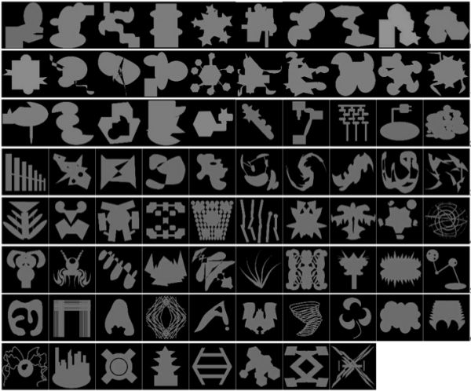
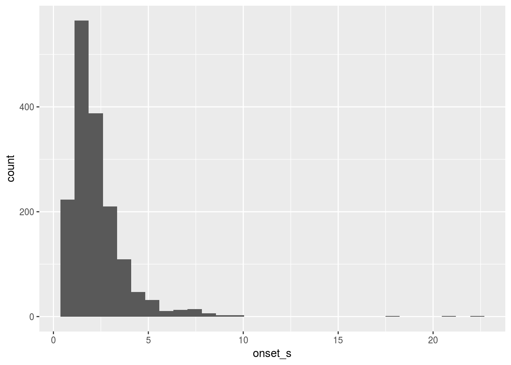

<style>
div.note { background-color:#e6f0ff; border-radius: 5px; padding: 20px; }
</style>

```{r setup, include=FALSE, message = FALSE}
## PLEASE DO NOT MODIFY ANYTHING IN THIS SETUP CHUNK! 

knitr::opts_chunk$set(echo = TRUE)

## code for validating this file
._my_file <- knitr:::knit_concord$get("infile")
rmd_chk_delim <- function(x) {
  lines <- readLines(._my_file)
  any(grepl(paste0("<!-- ", x), lines))
}
chk_formula <- function(x) {if (exists(x)) purrr::is_formula(get(x)) else FALSE}
chk_tibble <- function(x) {if (exists(x)) tibble::is_tibble(get(x)) else FALSE}
chk_type <- function(x, y) {if (exists(x)) {inherits(get(x), y)} else FALSE}
has_cols <- function(x, y) {
  if (chk_tibble(x)) {
    length(intersect(names(get(x)), y)) == length(y)
  } else FALSE
}
```

# Instructions

Leave everything above this section in the file. This RMarkdown file should be in your working directory as an .Rmd file with the binary data file you'll be working with (`trials.rds`).

You should then set your working directory for the console to point to this same location (from the pulldown menu, select Session | Set Working Directory...). 
Instead of at the end of the document, validation code appears directly under each problem. Make sure the validation code passes (returns `TRUE` for all tests) before moving onto the next step.

# Background

You will be looking at a dataset investigating issues in language production relating to the production of so-called “filled pauses” among speakers of Dutch and American English. This is real data collected by my lab in the U.S.A. and a colleague’s lab in the Netherlands around 2009. There were 20 American and 20 Dutch participants.

In this experiment, speakers were asked to describe unusual complicated shapes, like those seen in the set below:



In each trial of the experiment, participants saw a pair of pictures on the screen from the image set, and had to name one of the two pictures so that a listener could select is using a computer mouse. Because these pictures were hard to describe, speakers would often hesitate and produce so-called “fillers” (“um” or “uh”) preceding their descriptions. For instance, a speaker might say:

> 
> [480 ms silence] um.. [1022 ms silence] it looks like three snails stacked up
>

Note that there are pauses (measured in milliseconds) preceding and following the filler (in the example, ’um’). Your task in this assignment is to investigate the properties that cause speakers to produce fillers, as well as the factors that govern the choice of filler type (’um’ versus ’uh’).

Each picture was named three times (pictures get easier to describe each time, so the prediction would be that fillers get less likely).

The main topic we want to investigate is the relationship between fillers and hesitation pauses. We want to know: do fillers become more likely with longer pauses?

If you want to learn more about these issues, please consult the following article:

Clark, H. H., and Fox Tree, J. (2002). [Using 'uh' and 'um' in spontaneous speaking.](https://doi.org/10.1016/S0010-0277(02)00017-3) *Cognition*, 84, 73--111.

Note: This is multilevel data, with repeated sampling over participants (`subj_id`) and pictures (`pic_id`).

* `trials.rds`

Information about individual trials 

|column   |description|
|---------|---------------------------------------------------------------------|
|subj_id  | unique number identifying each subject|
|nat      | nationality (Amer= American or Dutch)|
|trial_id | unique number identifying each trial|
|pic_id   | unique number identifying each picture|
|prev_men | number of times picture was previously named by subject|
|filler   | identity of filler that was produced: no = no filler; uh,um; ot= other|
    onset    | latency onset of first (non-filler) word in the description (milliseconds)

## Set up your session

In the code chunk provided below, load in any packages you need and import the data from `trials.rds` using the `readRDS()` function.

```{r session-setup, message=FALSE}
## setup

## TODO: load packages

## TODO: import the data (hint: readRDS)
trials <- NULL
```

## Task 1

Before proceeding, remove all fillers of type 'ot' (other) from the dataset.  Store the resulting table in the variable `tclean`.  Use this as your source dataset in the following blocks.

```{r T01}
## get rid of all fillers of type 'ot'
tclean <- NULL
```

### Validation of `T01`

- `tclean` exists and is has correct column names: `r has_cols("tclean", names(trials))`

## Task 2

How many fillers of each type are in your dataset?  The result `n_types` should be a table with exactly two columns named `filler` and `n` of types `character` and `integer`, respectively.

```{r T02}
n_types <- NULL
```

### Validation of `T02`

- `n_types` exists and has columns `filler` and `n`: `r has_cols("n_types", c("filler", "n"))`

## Task 3

We are going to attempt to model the probability of a filler of any type (um or uh) as a function of the length of the pause preceding the first content word, as given by the variable `onset`.

The first thing that we should do is express onset in seconds rather than milliseconds.  Using a tidyverse function, add a new column to `tclean` called `onset_s` which expresses `onset` in seconds, rather than milliseconds.  Store the resulting table in `tclean2`.

```{r T03}
tclean2 <- NULL
```

### Validation of `T03`

- `tclean2` exists and has column `onset_s`: `r has_cols("tclean2", "onset_s")`

## Task 4

Let's have a look at the distribution of `onset_s` in the dataset `tclean2`.  Write code to create the graph below.



```{r T04}
## TODO: your ggplot code here
```

## Task 5

OK, that distribution does not look ideal.  Create a new variable in the `tclean2` dataset called `onset_slog` that is the log of `onset_s`, and store the resulting table in `tclean3`.  Plot the distribution of `onset_slog`.

```{r T05}
tclean3 <- NULL

## TODO: your ggplot code here
ggplot(tclean3)
```

That looks much better!  We will use `onset_slog` in our modeling.

### Validation of `T05`

- `tclean3` exists and has column `onset_slog`: `r has_cols("tclean3", "onset_slog")`

## Task 6

What we want to do next is to model the probability of a filler as a function of the length of the surrounding pause.

The variable containing the behavior you want to model is `filler`, which has three levels.  But to fit a logistic regression model, you first need a *dichotomous* response variable---a variable that has two categories.  Recode `filler` from `tclean3` into a new variable `anyfill` of type integer or numeric (*not* factor), which codes 'um' or 'uh' as `1` and 'no' as `0`.  The resulting table should be stored in the variable `tclean_af`.

*HINT*: `recode()`, `if_else()`, `case_when()`

```{r T06}
tclean_af <- NULL
```

### Validation of `T06`

- `tclean_af` exists and has column `anyfill`: `r has_cols("tclean_af", "anyfill")`

## Task 7

Categorical data can be difficult to visualize, because they are fundamentally just 1s and 0s, but it is important to nonetheless get some idea about the pattern you are trying to model before you go any further.

The main problem with categorical variable is that for each `x` observation (`onset`), you have a single `0` or `1` outcome variable.  It would be nice to plot proportions of "successes"" (e.g., producing a filler) but we can't do this for individual `x` values; however, we can do it for a *range* of `x` values. 

One common strategy to *bin* your predictor variable, which means breaking it into ranges and calculating an aggregate value for the range.

To understand how to bin data, study the code below, which bins up data from an example table and plots it.

```{r binning}
## THIS CODE BLOCK GIVES AN EXAMPLE; IT IS NOT PART OF THE ASSESSMENT
example_data <- tibble(time_ms = 1:1000, 
                       y = sample(0:1, 1000, TRUE))

## put the data into 100 ms bins
binned <- example_data %>%
  mutate(bin = floor((time_ms + 50) / 100) * 100)

bin_sum <- binned %>%
  group_by(bin) %>%
  summarise(p = mean(y), N = n())

ggplot(bin_sum, aes(bin, p)) + 
  geom_point(aes(size = N), alpha = .2) +
  coord_cartesian(ylim = c(0, 1)) +
  labs(y = "probability")
```

In the code chunk below, we will be working with `onset_slog` (which is in milliseconds), because that is what we'll be using in our modeling.  (Note that `onset_slog` has better properties for modeling the data, but is worse for understanding the data, so if we were to make this graph for a paper rather than for our own understanding, it probably would be better to visualize the data in terms of `onset`.)

Based on the example above, use the `tclean_af` table, bin up `onset_slog` into bins with bin size of .25 (call the binned variable `onset_bin`), and calculate the probability of a filler (`p`) for each bin.  The resulting table should contain `onset_bin` and `p`, and should be named `tclean_bin`.

```{r T07}
tclean_bin <- NULL
```

### Validation of `T07`

- `tclean_bin` exists and has columns `onset_bin` and `p`: `r has_cols("tclean_bin", c("onset_bin", "p"))`

## Task 8

Make a plot like the one above, showing `p` as a function of `onset_bin`.

```{r T08}
g <- ggplot(tclean_bin) 

g
```

## Task 9

Fit a logistic regression on the dataset `tclean_af` with `anyfill` as the response measure and `onset_slog` as the predictor, with appropriate by-subject and by-picture random effects.  The resulting model *must* be stored in `mod`.

```{r T09, cache = TRUE}
mod <- NULL
```

```{r T09b}
summary(mod) 
```

### Validation of `T09`

- `mod` exists and is of type `merMod`: `r chk_type("mod", "merMod")`

## Task 10

Next we want to visualise the model predictions; in particular, we want to plot the predicted *probability of a filler* as a function of the delay (`onset_slog`) against the observed values.  Note that you have already created the graph of your observed data for task 8 but with `onset_s` instead of `onset_slog`. What you want to do now is recreate it but adding in the predictions from the model. We'll do this over multiple steps.

As a first step, we need to make a tibble `newdat` that has new values of `onset_slog` for which we will generate model predictions.  The column `onset_slog` should have values in increments of .01 over the approximate range of `onset_slog`, -1 to 3.  (Hint: `?seq`).

### Validation of `T10`

```{r T10}
newdat <- NULL
```

- `newdat` exists and has column `onset_slog`: `r has_cols("newdat", "onset_slog")`

## Task 11

Now we will use the `predict()` function to generate model predictions and store them in `mod_pred`.  Please see `?predict.merMod()` to understand how the `predict()` function works with mixed-effects models.  You will want to ignore random effects and make predictions on the probability scale, not the log odds scale.  (Hint: `re.form` and `type`. Read the documentation!)  The predictions should be added as a column to `newdat` with the name `p`. 

```{r T11}
mod_pred <- NULL
```

### Validation of `T11`

* `mod_pred` is a tibble with columns `onset_slog` and `p`: `r has_cols("mod_pred", c("onset_slog", "p"))`

## Task 12

OK, now add the predicted values to your plot as a line.  Hint: you might need to rename `onset_slog` to the same `x` variable name you used in your plot.

```{r T12}
## TODO: your code
```

<div class="note">
The fit of your model is not great for long pauses. Take a moment to think about why that might be happening.
</div>

## Task 13

According to your model, how long does the hesitation need to be (in seconds) for the probability of a filler to be .5?

```{r T13}
pause_len <- NULL
```
