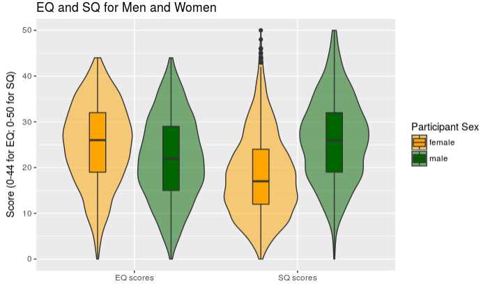

```{r opts, echo = FALSE}
#suppress the warnings and other messages from showing in the knitted file.
knitr::opts_chunk$set(
  fig.width  = 8, 
  fig.height = 5, 
  fig.path   = 'images/coursework1/',
  echo       = TRUE, 
  warning    = FALSE, 
  message    = FALSE
)
```

# Some things you'll need to know

- working with dates (`vignette("lubridate")`)
- dplyr windowed functions (`vignette("window-functions")`), particularly `group_by() %>% filter()`
- RMarkdown inline code; see [RMarkdown cheat sheet](https://www.rstudio.org/links/r_markdown_cheat_sheet)
- using `dplyr::recode()`

# Data

Data in the files [empathizing.csv](empathizing.csv) and [systemizing.csv](systemizing.csv) are responses to the short forms of the [Empathy Quotient and Systemizing Quotient short forms](https://doi.org/10.1016/j.paid.2006.03.017).

The variable `user_id` is the participant's unique ID, while the variable `id` is a unique ID for that questionnaire completion. Some participants completed both questionnaires on the same day, others only completed one, others completed the questionnaires multiple times. The columns `starttime` and `endtime` contain the timestamps for when each questionnaire was started and completed.

*Scoring*: An individual scores two points if they strongly display a systemizing/empathizing response, and one point if they slightly display a systemizing/empathizing response (i.e., each forward (F) item scored 2, 1, 0, 0; each reversed (R) item scored 0, 0, 1, 2). 

In the data files, responses were coded as follows:

* 1 = Strongly agree
* 2 = Slightly agree
* 3 = Slightly disagree
* 4 = Strongly disagree

## Empathizing (EQ-Short)

q2663,	F,  I can easily tell if someone else wants to enter a conversation.  
q2664,	F,  I really enjoy caring for other people.  
q2665,	R,  I find it hard to know what to do in a social situation.  
q2666,	R,  I often find it difficult to judge if something is rude or polite.  
q2667,	R,  In a conversation, I tend to focus on my own thoughts rather than on what my listener might be thinking.  
q2668,  F,	I can pick up quickly if someone says one thing but means another.  
q2669,	R,  It is hard for me to see why some things upset people so much.  
q2670,  F,	I find it easy to put myself in somebody else’s shoes.  
q2671,  F,	I am good at predicting how someone will feel.  
q2672,  F,	I am quick to spot when someone in a group is feeling awkward or uncomfortable.  
q2673,	R,  I can’t always see why someone should have felt offended by a remark.  
q2674,  F,	I don’t tend to find social situations confusing.  
q2675,  F,	Other people tell me I am good at understanding how they are feeling and what they are thinking.  
q2676,  F,	I can easily tell if someone else is interested or bored with what I am saying.  
q2677,  F,	Friends usually talk to me about their problems as they say that I am very understanding.  
q2678,  F,	I can sense if I am intruding, even if the other person doesn’t tell me.  
q2679,	R,  Other people often say that I am insensitive, though I don’t always see why.  
q2680,  F,	I can tune into how someone else feels rapidly and intuitively.  
q2681,  F,	I can easily work out what another person might want to talk about.  
q2682,  F,	I can tell if someone is masking their true emotion.  
q2683,  F,	I am good at predicting what someone will do.  
q2684,  F,	I tend to get emotionally involved with a friend’s problems.  
	

## Systemizing (SQ-Short)

q2616,  F,  If I were buying a car, I would want to obtain specific information about its engine.  
q2617,  F,  If there was a problem with the electrical wiring in my home, I’d be able to fix it myself.  
q2618,	R,  I rarely read articles or web pages about new technology.  
q2619,	R,  I do not enjoy games that involve a high degree of strategy.  
q2620,  F,  I am fascinated by how machines work.  
q2621,  F,	In math, I am intrigued by the rules and patterns governing numbers.  
q2622,	R,  I find it difficult to understand instruction manuals for putting appliances together.  
q2623,  F,	If I were buying a computer, I would want to know exact details about its hard disc drive capacity and processor speed.  
q2624,	R,  I find it difficult to read and understand maps.  
q2625,	R,  When I look at a piece of furniture, I do not notice the details of how it was constructed.  
q2626,	R,  I find it difficult to learn my way around a new city.  
q2627,	R,  I do not tend to watch science documentaries on television or read articles about science and nature.  
q2628,  F,	If I were buying a stereo, I would want to know about its precise technical features.  
q2629,  F,	I find it easy to grasp exactly how odds work in betting.  
q2630,	R,  I am not very meticulous when I carry out D.I.Y.  
q2631,  F,	When I look at a building, I am curious about the precise way it was constructed.  
q2632,	R,  I find it difficult to understand information the bank sends me on different investment and saving systems.  
q2633,  F,	When travelling by train, I often wonder exactly how the rail networks are coordinated.  
q2634,	R,  If I were buying a camera, I would not look carefully into the quality of the lens.  
q2635,	R,  When I hear the weather forecast, I am not very interested in the meteorological patterns.  
q2636,  F,	When I look a mountain, I think about how precisely it was formed.  
q2637,  F,	I can easily visualize how the motorways in my region link up.  
q2638,	R,  When I’m in a plane, I do not think about the aerodynamics.  
q2639,  F,	I am interested in knowing the path a river takes from its source to the sea.  
q2640,	R,  I am not interested in understanding how wireless communication works.  

# Assignment

Answer the following questions by editing the code block below each question.

Note: please enter the *code* that generates the correct answer; don't simply type in the numbers.  The code should give the right answers even if the source data files change (new rows of values are added or subtracted).

Setup block.  Load any add-on packages you need here.  

```{r setup}
## TODO: library(something)
library("lubridate")
library("tidyverse")
```

## Loading and inspecting files

1. Load in the two CSV files.  How many times were the empathizing and systemizing questionnaires completed? Save these as the variables:

    * `emp_total_n` 
    * `sys_total_n`

```{r P1}
sys <- read_csv("systemizing.csv")
emp <- read_csv("empathizing.csv")

emp_total_n <- nrow(emp)
sys_total_n <- nrow(sys)
```

## Calculating durations

How long did it take people to complete each questionnaire? 

2. Create the following variables:

* `mean_emp` = mean duration (in seconds) for empathizing questionnaire (before exclusions)
* `sd_emp` = SD of duration (in seconds) for empathizing questionnaire (before exclusions)
* `mean_sys` = mean duration (in seconds) for systemizing questionnaire (before exclusions)
* `sd_sys` = SD of duration (in seconds) for systemizing questionnaire (before exclusions)

```{r P2}
emp2 <- emp %>%
  select(starttime, endtime) %>%
  mutate(questionnaire = "empathizing") %>%
  mutate(duration = as.integer(endtime - starttime))

sys2 <- sys %>%
  select(starttime, endtime) %>%
  mutate(questionnaire = "systemizing") %>%
  mutate(duration = as.integer(endtime - starttime))

mean_emp <- emp2 %>% pull(duration) %>% mean()
sd_emp <- emp2 %>% pull(duration) %>% sd()
mean_sys <- sys2 %>% pull(duration) %>% mean()
sd_sys <- sys2 %>% pull(duration) %>% sd()
```

3. Graph the distributions for each questionnaire after excluding times that are more than 3 SDs above the mean for each questionnaire. 

```{r P3}
bind_rows(emp2, sys2) %>%
  # remove durations > 3SD above the mean for that Q
  group_by(questionnaire) %>%
  filter(duration <= mean(duration) + 3 * sd(duration)) %>%
  ggplot(aes(duration, fill = questionnaire)) + 
  geom_density(alpha = 0.5) +
  xlab("Duration (in seconds)")
```

## Questionnaire completion

4. How many people completed both questionnaires *for the first time* on the same day? Save this number as  `first_time_n`.

**Remember to check for people who completed a questionnaire more than once.**

```{r P4}
## one acceptable way
emp_firsttime <- emp %>%
  group_by(user_id) %>%
  filter(id == min(id)) %>%
  ungroup() %>%
  mutate(date = substr(endtime, 1, 10))

sys_firsttime <- sys  %>%
  group_by(user_id) %>%
  filter(id == min(id)) %>%
  ungroup() %>%
  mutate(date = substr(endtime, 1, 10))

## another acceptable way
emp_firsttime2 <- emp %>%
  group_by(user_id) %>%
  filter(rank(endtime) == 1) %>%
  ungroup() %>%
  mutate(date = substr(endtime, 1, 10))

sys_firsttime2 <- sys  %>%
  group_by(user_id) %>%
  filter(rank(endtime) == 1) %>%
  ungroup() %>%
  mutate(date = substr(endtime, 1, 10))

## join them
emp_sys <- inner_join(
  emp_firsttime, sys_firsttime, 
  by = c("user_id", "sex", "age", "date"), 
  suffix = c(".emp", ".sys")
)

emp_sys2 <- inner_join(
  emp_firsttime2, sys_firsttime2, 
  by = c("user_id", "sex", "age", "date"), 
  suffix = c(".emp", ".sys")
)

first_time_n <- nrow(emp_sys)
first_time_n2 <- nrow(emp_sys2)
```

## Respondent demographics

5. Create a table of demographic information by sex with the columns 
`sex`, `n`, `mean age`, `sd age`, and `number missing age`, only for people who completed both questionnaires for the first time on the same day (i.e., use the data table you created for question 3). Save the table as `demog_table`.

```{r P5}
demog_table <- emp_sys %>%
  group_by(sex) %>%
  summarise(
    n = n(),
    `mean age` = mean(age, na.rm = TRUE),
    `sd age` = sd(age, na.rm = TRUE),
    `number missing age` = sum(is.na(age))
  )

# also acceptable
demog_table2 <- emp_sys %>%
  group_by(sex) %>%
  summarise(
    n = n(),
    `mean age` = mean(age, na.rm = TRUE),
    `sd age` = sd(age, na.rm = TRUE),
    `number missing age` = sum(is.na(age))
  ) %>%
  na.omit()

```

6. What is wrong with the SD? Address it by changing implausible ages to `NA` and re-calcuating the table above, saving it as `demog_table_fixed`.

```{r P6}
# the SD is way too big 
# check what's going on with the age distibution
ggplot(emp_sys, aes(age)) + geom_histogram(binwidth = 1)

# plot again after getting rid of the immortals
emp_sys %>%
  filter(age < 1000) %>%
  ggplot(aes(age)) + geom_histogram(binwidth = 1)

# set implausible ages to NA
demog_table_fixed <- emp_sys %>%
  mutate(age = ifelse(age > 75 | age < 10, NA, age)) %>%
  group_by(sex) %>%
  summarise(
    n = n(),
    `mean age` = mean(age, na.rm = TRUE),
    `sd age` = sd(age, na.rm = TRUE),
    `number missing age` = sum(is.na(age))
  )

demog_table_fixed
```

## Exclusions
    
If someone takes less than 30 seconds to fill out the questionnaire or gives  the same reponse for every question, we can assume they aren't taking the study seriously.  

7. Filter out non-serious responders. Store the resulting data in the variable named `emp_sys_cleaned`.  You will use this as the source table in later problems.

```{r P7}
## there are at least two ways to do this: YIN and YANG

## find all users who only gave one answer
excluded <- emp_sys %>%
  mutate(
    duration.emp = as.integer(endtime.emp - starttime.emp),
    duration.sys = as.integer(endtime.sys - starttime.sys)
  ) %>%
  gather("q", "score", q2663:q2684, q2616:q2640) %>%
  mutate(
    q = as.integer(gsub("q", "", q)),
    questionnaire = ifelse(q > 2662, "emp", "sys"),
    duration = ifelse(questionnaire == "emp", duration.emp, duration.sys)
  ) %>%
  group_by(user_id, questionnaire, duration) %>%
  summarise(dist_resp = n_distinct(score)) %>%
  ungroup() %>%
  filter(dist_resp == 1 | duration < 30)

# exclude from emp_sys table
emp_sys_cleaned <- anti_join(emp_sys, excluded, by = "user_id")

## here another way to do this

## first, get rid of the short responses
emp_sys2 <- emp_sys %>%
  filter(as.integer(endtime.emp - starttime.emp) >= 30,
         as.integer(endtime.sys - starttime.sys) >= 30)

## get rid of repeated responders for emp
emp_only <- emp_sys2 %>%
  select(user_id:date) %>%
  gather("question", "answer", q2663:q2684) %>%
  group_by(user_id) %>%
  summarise(ndist = n_distinct(answer)) %>%
  filter(ndist > 1L)

## get rid of them for sys
sys_only <- emp_sys2 %>%
  select(user_id, id.sys:endtime.sys) %>%
  gather("questions", "answer", q2616:q2640) %>%
  group_by(user_id) %>%
  summarise(ndist = n_distinct(answer)) %>%
  filter(ndist > 1L)

subjects_to_keep <- semi_join(emp_only, sys_only, "user_id")

## now filtering join
emp_sys_cleaned_djb <- semi_join(emp_sys, subjects_to_keep, "user_id")

## hallelujah! they give the same result!
setequal(emp_sys_cleaned, emp_sys_cleaned_djb)
```

8. Create the following variables:
 
- `excluded_short` = How many people took less than 30 seconds on at least one questionnaire? 
- `excluded_one` = How many people gave the same response to each question in at least one questionnaire?
- `excluded_total` = How many people are you excluding in total?

```{r P8}
# count all excluded
n_excluded <- excluded %>%
  group_by(user_id) %>%
  summarise(
    too_short = min(duration) < 30,
    one_answer = min(dist_resp) == 1
  ) %>%
  group_by(too_short, one_answer) %>%
  summarise(n = n())

excluded_total <- n_excluded %>%
  pull(n) %>%
  sum()

excluded_one <- n_excluded %>%
  filter(one_answer == TRUE) %>%
  pull(n) %>%
  sum()

excluded_short <- n_excluded %>%
  filter(too_short == TRUE) %>%
  pull(n) %>%
  sum()
```
    
9. Write up your exclusion criteria and numbers of participants excluded as if for the methods section of a paper.  Use inline code to generate any numbers used in your description; don't just type them.

<!-- this is an HTML comment: start here -->

TODO: REPLACE THIS TEXT HERE WITH YOUR ANSWER!

<!-- this is an HTML comment: end here -->

## Create EQ and SQ scores

Calculate the EQ and SQ scores from the questionnaire responses.
    
Remember that forward coded (F) questions are coded: 
    
(1) strongly agree = 2
(2) slightly agree = 1
(3) slightly disagree = 0
(4) strongly disagree = 0
    
while reverse-coded (R) questions are coded: 
    
(1) strongly agree = 0
(2) slightly agree = 0
(3) slightly disagree = 1
(4) strongly disagree = 2

10. Create a table of mean EQ and SQ by sex and save it as `EQ_SQ_scores`. Include the columns `sex`, `n`, `mean_EQ`, `mean_SQ`, `missing_EQ`, and `missing_SQ` (how many people have a missing score).

```{r P10}

emp_score <- tribble(
  ~q, ~direction, ~text,
"q2663",	"F",  "I can easily tell if someone else wants to enter a conversation.",  
"q2664",	"F",  "I really enjoy caring for other people.",  
"q2665",	"R",  "I find it hard to know what to do in a social situation.",  
"q2666",	"R",  "I often find it difficult to judge if something is rude or polite.",  
"q2667",	"R",  "In a conversation, I tend to focus on my own thoughts rather than on what my listener might be thinking.",  
"q2668",  "F",	"I can pick up quickly if someone says one thing but means another.",  
"q2669",	"R",  "It is hard for me to see why some things upset people so much.",  
"q2670",  "F",	"I find it easy to put myself in somebody else’s shoes.",  
"q2671",  "F",	"I am good at predicting how someone will feel.",  
"q2672",  "F",	"I am quick to spot when someone in a group is feeling awkward or uncomfortable.",  
"q2673",	"R",  "I can’t always see why someone should have felt offended by a remark.",  
"q2674",  "F",	"I don’t tend to find social situations confusing.",  
"q2675",  "F",	"Other people tell me I am good at understanding how they are feeling and what they are thinking.",  
"q2676",  "F",	"I can easily tell if someone else is interested or bored with what I am saying.",  
"q2677",  "F",	"Friends usually talk to me about their problems as they say that I am very understanding.",  
"q2678",  "F",	"I can sense if I am intruding, even if the other person doesn’t tell me.",  
"q2679",	"R",  "Other people often say that I am insensitive, though I don’t always see why.",  
"q2680",  "F",	"I can tune into how someone else feels rapidly and intuitively.",  
"q2681",  "F",	"I can easily work out what another person might want to talk about.",  
"q2682",  "F",	"I can tell if someone is masking their true emotion.",  
"q2683",  "F",	"I am good at predicting what someone will do.",  
"q2684",  "F",	"I tend to get emotionally involved with a friend’s problems."
)

sys_score <- tribble(
  ~q, ~direction, ~text,
"q2616",  "F",  "If I were buying a car, I would want to obtain specific information about its engine.",  
"q2617",  "F",  "If there was a problem with the electrical wiring in my home, I’d be able to fix it myself.",  
"q2618",	"R",  "I rarely read articles or web pages about new technology.",  
"q2619",	"R",  "I do not enjoy games that involve a high degree of strategy.",  
"q2620",  "F",  "I am fascinated by how machines work.",  
"q2621",  "F",	"In math, I am intrigued by the rules and patterns governing numbers.",  
"q2622",	"R",  "I find it difficult to understand instruction manuals for putting appliances together.",  
"q2623",  "F",	"If I were buying a computer, I would want to know exact details about its hard disc drive capacity and processor speed.",  
"q2624",	"R",  "I find it difficult to read and understand maps.", 
"q2625",	"R",  "When I look at a piece of furniture, I do not notice the details of how it was constructed.",  
"q2626",	"R",  "I find it difficult to learn my way around a new city.",  
"q2627",	"R",  "I do not tend to watch science documentaries on television or read articles about science and nature.",  
"q2628",  "F",	"If I were buying a stereo, I would want to know about its precise technical features.",  
"q2629",  "F",	"I find it easy to grasp exactly how odds work in betting.",  
"q2630",	"R",  "I am not very meticulous when I carry out D.I.Y.",  
"q2631",  "F",	"When I look at a building, I am curious about the precise way it was constructed.",  
"q2632",	"R",  "I find it difficult to understand information the bank sends me on different investment and saving systems." , 
"q2633",  "F",	"When travelling by train, I often wonder exactly how the rail networks are coordinated.",  
"q2634",	"R",  "If I were buying a camera, I would not look carefully into the quality of the lens.",  
"q2635",	"R",  "When I hear the weather forecast, I am not very interested in the meteorological patterns.",  
"q2636",  "F",	"When I look a mountain, I think about how precisely it was formed.",  
"q2637",  "F",	"I can easily visualize how the motorways in my region link up.",  
"q2638",	"R",  "When I’m in a plane, I do not think about the aerodynamics.",  
"q2639",  "F",	"I am interested in knowing the path a river takes from its source to the sea.",  
"q2640",	"R",  "I am not interested in understanding how wireless communication works."  
)

scores <- bind_rows(
  mutate(emp_score, questionnaire = "emp"),
  mutate(sys_score, questionnaire = "sys")
)

emp_sys_scores <- emp_sys_cleaned %>%
  gather("q", "score", q2663:q2684, q2616:q2640) %>%
  left_join(scores, by="q") %>%
  mutate(
    conv_score = 
      ifelse(direction == "F",
             recode(score, "1" = 2, "2" = 1, "3" = 0, "4" = 0),
             recode(score, "1" = 0, "2" = 0, "3" = 1, "4" = 2)
            )
  ) %>%
  select(user_id:endtime.sys, questionnaire, conv_score) %>%
  group_by(user_id, sex, id.sys, id.emp, questionnaire) %>%
  summarise(score = sum(conv_score))


EQ_SQ_scores <- emp_sys_scores %>%
  spread(questionnaire, score) %>%
  group_by(sex) %>%
  summarise(
    n = n(),
    mean_EQ = mean(emp, na.rm = TRUE),
    mean_SQ = mean(sys, na.rm = TRUE),
    missing_EQ = sum(is.na(emp)),
    missing_SQ = sum(is.na(sys))
  )
```

11. Write code to re-create the following graph of the EQ and SQ score distributions for men and women. 



```{r P11}
emp_sys_scores %>%
  filter(sex %in% c("male", "female")) %>%
  ggplot(aes(questionnaire, score, fill = sex)) + 
  geom_violin(alpha = 0.5) +
  geom_boxplot(width = 0.2, position = position_dodge(width = 0.9)) +
  scale_fill_manual(values = c("orange", "darkgreen"), name = "Participant Sex") +
  scale_x_discrete(labels = c("EQ scores", "SQ scores")) +
  labs(title = "EQ and SQ for Men and Women", x = "", y = "Score (0-44 for EQ; 0-50 for SQ)")
  
```
